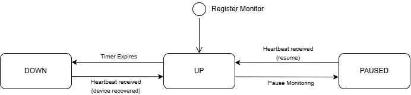

# Pulse-Check API

A Dead Man's Switch monitoring service for remote devices.

This API monitors remote devices by maintaining countdown timers for each registered monitor. Devices are expected to periodically send heartbeat signals. If a heartbeat is not received before the timeout expires, the system automatically triggers an alert and marks the monitor as down.

---

## Architecture Diagram

The monitor lifecycle is managed through three states: **Up**, **Paused**, and **Down**.

When a monitor is registered, it enters the **Up** state and a countdown timer is started. Each heartbeat resets the timer and keeps the monitor active. If monitoring is paused, the timer is stopped and no alerts are generated. If the timer expires before a heartbeat is received, the monitor transitions to the **Down** state and an alert is triggered. A heartbeat received from either a paused or down monitor automatically restores it to the **Up** state and restarts monitoring.




---

## Overview

The system allows administrators to:

* Register monitors for remote devices
* Receive heartbeat signals from devices
* Pause monitoring during maintenance
* View monitor information
* View all monitors
* Delete monitors that are no longer needed
* Automatically detect device failures and trigger alerts

The application uses in-memory storage and Python timers to manage monitor state.

---

## Setup Instructions

### Clone the Repository

```bash
git clone <repository-url>
cd pulse-check-api
```

### Create a Virtual Environment

```bash
python -m venv venv
```

### Activate the Virtual Environment

Windows:

```bash
venv\Scripts\activate
```

### Install Dependencies

```bash
pip install -r requirements.txt
```

### Run the Application

```bash
python app.py
```

The API will be available at:

```text
http://127.0.0.1:5000
```

---

## API Documentation

### Health Check

#### GET /

Returns a message confirming that the API is running.

Response:

```json
{
  "message": "Pulse-Check API is running"
}
```

---

### Create Monitor

#### POST /monitors

Creates a new monitor and starts its countdown timer.

Request Body:

```json
{
  "id": "device-123",
  "timeout": 60,
  "alert_email": "admin@critmon.com"
}
```

Response:

```json
{ 
  "message": "Monitor device-123 created successfully", 
  "monitor": { 
    "alert_email": "admin@critmon.com", 
    "id": "device-123", 
    "last_heartbeat_at": "2026-06-19T22:38:03.700701+00:00", 
    "status": "up", 
    "timeout": 60 
    } 
}
```

Status Code:

```text
201 Created
```

---

### Get All Monitors

#### GET /monitors

Returns all registered monitors.

Response:

```json
{
  "monitors": [
    {
      "alert_email": "admin@critmon.com", 
      "id": "device-123", 
      "last_heartbeat_at": "2026-06-19T22:38:03.700701+00:00", 
      "status": "up", 
      "timeout": 60
    }
  ]
}
```

---

### Get Monitor

#### GET /monitors/{id}

Returns information about a specific monitor.

Response:

```json
{
  "alert_email": "admin@critmon.com", 
  "id": "device-123", 
  "last_heartbeat_at": "2026-06-19T22:38:03.700701+00:00", 
  "status": "up", 
  "timeout": 60
}
```

Status Code:

```text
200 OK
```

Possible Errors:

```text
404 Not Found
```

---

### Heartbeat

#### POST /monitors/{id}/heartbeat

Resets the monitor timer and updates the last heartbeat timestamp.

Response:

```json
{ 
  "message": "Heartbeat received for monitor device-123", 
  "monitor": { 
    "alert_email": "admin@critmon.com", 
    "id": "device-123", 
    "last_heartbeat_at": "2026-06-19T22:38:10.760689+00:00", 
    "status": "up", 
    "timeout": 60 
    } 
}
```

Status Code:

```text
200 OK
```

Possible Errors:

```text
404 Not Found
```

---

### Pause Monitor

#### POST /monitors/{id}/pause

Pauses monitoring for a device. The timer is stopped and no alerts will be triggered while paused.

Response:

```json
{ 
  "message": "Monitor device-123 paused successfully", 
  "monitor": { 
    "alert_email": "admin@critmon.com", 
    "id": "device-123", 
    "last_heartbeat_at": "2026-06-19T22:38:10.760689+00:00", 
    "status": "paused", 
    "timeout": 60 
    } 
}
```

Status Code:

```text
200 OK
```

Possible Errors:

```text
404 Not Found
```

---

### Delete Monitor

#### DELETE /monitors/{id}

Removes a monitor from the system and cancels any active timer.

Response:

```json
{
  "message": "Monitor device-123 deleted successfully"
}
```

Status Code:

```text
200 OK
```

Possible Errors:

```text
404 Not Found
```

---

## Alert Behavior

When a monitor fails to send a heartbeat before its timeout expires:

1. The timer expires.
2. The monitor status changes to `down`.
3. An alert is triggered.
4. The alert is logged to the console.

Example:

```json
{
  "ALERT": "Device device-123 is down!",
  "time": "2026-06-19T22:22:44.603784+00:00",
  "alert_email": "admin@critmon.com"
}
```

---

## Design Decisions

### In-Memory Storage

Monitors are stored in a Python dictionary.

This approach keeps the implementation simple and lightweight while satisfying the requirements of the challenge.

Since storage is in memory, all monitor data is lost when the application restarts.

### Timer-Based Monitoring

Each monitor owns a dedicated timer.

Whenever a heartbeat is received, the existing timer is cancelled and a new timer is created. This ensures that alerts are triggered only when the monitor has been inactive longer than its configured timeout.

### Automatic Recovery

A heartbeat received from a paused or down monitor automatically returns it to the active state and restarts monitoring.

---

## Developer's Choice

I added three admin-focused endpoints to make the system more usable:

```text
GET /monitors
GET /monitors/{id}
DELETE /monitors/{id}
```

The `GET` endpoints allow administrators to inspect monitor status and confirm whether devices are `up`, `paused`, or `down`.

The `DELETE` endpoint allows administrators to remove monitors that are no longer required. Before deletion, any active timer associated with the monitor is cancelled to prevent unnecessary alerts from being triggered after the monitor has been removed.
